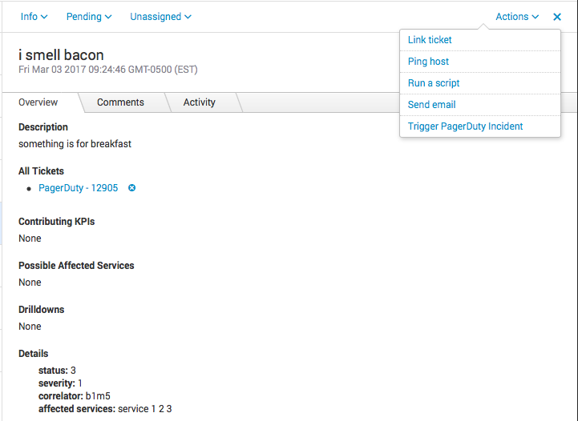

# pagerduty-itsi
Splunk ITSI -> PagerDuty integration



This is Notable Event Action that triggers a PagerDuty incident. It also updates the Notable Event with a direct link to the PagerDuty incident that was created (you may need to refresh the Notable Event after the action runs in order to see the link.)

## Instructions for use:

1. Create a Custom Event Transformer integration in PagerDuty and make a note of the URL. Edit the integration and replace the JavaScript code with the text in custom-event-transformer.js

2. Create a read-only PagerDuty API v2 token

3. Copy pagerduty_itsi.py to SPLUNK_HOME/etc/apps/SA-ITOA/bin

4. Copy pagerduty_itsi.html to SPLUNK_HOME/etc/apps/SA-ITOA/default/data/ui/alerts

5. Edit SPLUNK_HOME/etc/apps/SA-ITOA/local/alert_actions.conf and add the following text at the bottom:

```
[pagerduty_itsi]
is_custom = 1
param.integration_url = *<your integration URL from step 1>*
param.token = *<your API token from Step 2>*
label = Trigger PagerDuty Incident
description = Trigger an incident in PagerDuty
payload_format = json
```

6. Edit SPLUNK_HOME/etc/apps/SA-ITOA/local/notable_event_actions.conf and add the following text at the bottom:

```
[pagerduty_itsi]
disabled = 0
execute_once_per_group = 0
```

7. Restart Splunk: SPLUNK_HOME/bin/splunk restart

You should now see a new item called "Trigger PagerDuty Incident" in the Actions menu in Notable Events.